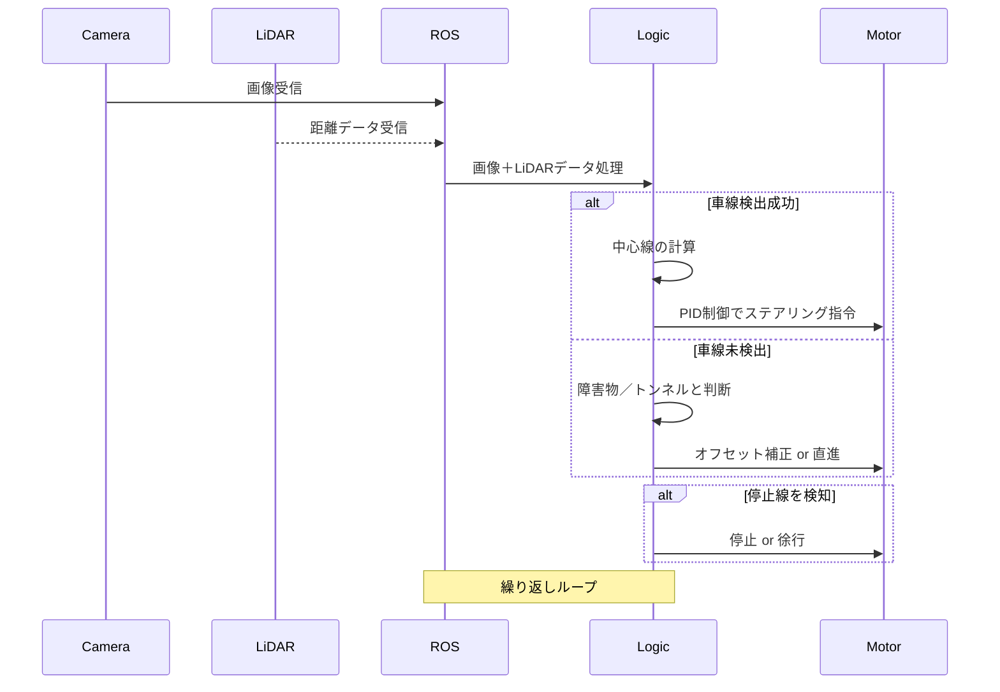

# 🚗 ROSベースのカメラ & LiDAR自動運転システム


## 概要（Overview）


本プロジェクトは、ROS（Robot Operating System）をベースにしたXYCarプラットフォーム上で動作する自動運転システムです。

カメラ画像とLiDARセンサを活用し、車線検出・障害物回避・停止線認識など複数の走行シナリオに対応するロジックを実装しています。


---


## 主な機能（Features）


* **カメラ画像を用いたリアルタイム車線認識**

* **PID制御によるステアリング制御**

* **LiDARを用いた障害物検出およびS字回避アルゴリズム**

* **停止線の認識と段階的な減速／停止処理**

* **トンネル内の車線未検出時、LiDARで代替制御**


---


## システム構成（System Architecture）





---


## 依存ライブラリ（Dependencies）


* Python 2.x

* ROS（Kinetic推奨）

* OpenCV

* NumPy

* `sensor_msgs`（Image / LaserScan）

* `xycar_msgs`（XYCar専用メッセージ）


---


## セットアップと実行方法（Installation & Execution）


### 1. ROSワークスペースに配置


```bash

cd ~/catkin_ws/src

git clone <リポジトリURL>

cd ~/catkin_ws

catkin_make

source devel/setup.bash

```


### 2. ノード起動


```bash

roscore

roslaunch xycar_pkg xycar_auto_drive.launch  

```


---


## ファイル構成と説明（Main Files）


| ファイル名                | 説明                          |

| -------------------- | --------------------------- |

| `main.py`            | 自動運転全体を制御するメインスクリプト         |

| `PID()`              | オフセット値からステアリング角を算出するPID制御関数 |

| `img_callback()`     | カメラ画像受信コールバック関数             |

| `lidar_callback()`   | LiDARデータ受信コールバック関数          |

| `check_obstacles()`  | 正面／左右の障害物距離を測定              |

| `avoid_s_curve()`    | 距離差に基づいたS字回避アルゴリズム          |

| `detect_stop_line()` | 停止線検出（ROI内の白ピクセル割合判定）       |

| `start()`            | 全処理の統括と制御ループの実行             |


---


## 制御ロジック概要（Control Logic）


* Canny + Hough変換により車線を検出し、中心線を計算

* 中心線のずれをPID制御によりステアリング角として出力

* LiDARにより障害物の有無と位置を把握し、回避判断

* 車線未検出時はトンネル状況と判断し、LiDARのみで補正制御

* 停止線を検知した際は段階的に減速・停止を実施


---


## テスト環境（Test Environment）


* XYCar ROSプラットフォーム

* Ubuntu 16.04 / ROS Kinetic

* カメラ解像度: 640x480

* LiDAR: 504ポイントスキャン（LaserScan型）


---


## 今後の改善点（To-do / Future Work）


* LiDAR補正精度の向上

* 機械学習ベースの車線検出への置換（CNN等）

* ノードのモジュール分離とテストの導入

* 回避制御アルゴリズムの最適化

* ROS2への移行対応


---


## 終了方法（Shutdown）


ユーザーによる終了（`q`キー入力）またはCtrl+Cにより、`cv2.destroyAllWindows()` および `rospy.signal_shutdown()` が実行されます。


---


## 参考文献（References）


* ROS公式ドキュメント: [http://wiki.ros.org](http://wiki.ros.org)

* OpenCV Python公式ドキュメント

* XYCarオープンソースプロジェクト


---
